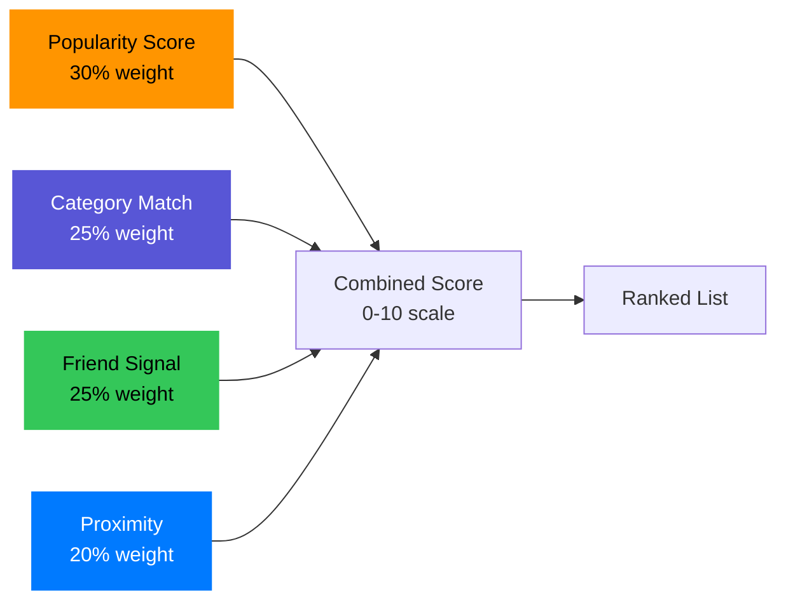

# Luna - Social Venue Discovery Platform

**A production-ready, full-stack iOS application for discovering venues with intelligent recommendations, real-time social feeds, and automated booking coordination**

   

## 📬 Quick Links

- **GitHub:** [Krut-in/SwiftAssessment](https://github.com/Krut-in/SwiftAssessment)
- **Email:** krutin31@gmail.com

---

## 🎯 Overview

Luna is a sophisticated venue discovery application combining Swift/SwiftUI on iOS with Python/FastAPI backend infrastructure. The platform enables social venue exploration through intelligent matching algorithms, real-time friend activity tracking, and automated group coordination.

**Core Value Proposition:**
- **Intelligent Discovery** - Machine-scored recommendations (0-10 scale) based on preferences, social signals, and proximity
- **Real-Time Social Feeds** - Live friend activity timelines with auto-refresh polling and toast notifications
- **Automated Coordination** - Booking agent triggers action items when 5+ users express interest in a venue
- **Premium UI/UX** - Hero cards, match meters, skeleton loading states, and glassmorphic design elements
- **Zero External Dependencies (iOS)** - Pure SwiftUI/Combine architecture leveraging native frameworks

---

## ✨ Key Features

### iOS App Architecture (4-Tab Navigation)

#### **📍 Discover Tab**
- **Hero Venue Card** with cinematic 16:9 images and dynamic category accents
- Category-filtered grid with color-coded badges (Coffee, Restaurant, Bar, Cultural, Outdoor, Entertainment)
- Map/List toggle with interactive MapKit pins and venue clustering
- Advanced filtering: Distance radius, interest status, category multi-select
- Sorting options: Popularity, distance, friend count, alphabetical
- **Skeleton loading views** for perceived performance optimization

#### **✨ For You Tab**
- Personalized recommendation engine with transparent scoring breakdown
- **Match Meter** visualization replacing traditional score badges
- **"Why This?" callout cards** explaining recommendation reasoning
- Dynamic card layouts with visual rhythm variations
- Context-aware header with time-based greetings
- Pull-to-refresh with recommendation re-ranking

#### **👥 Social Tab**
- **"Hot Right Now"** section highlighting venues with 5+ interested friends
- Real-time activity timeline with avatar stacks and timestamp formatting
- Auto-refresh polling (30-second intervals) with new activity toast notifications
- Infinite scroll pagination for historical activities
- Interest activity cards with venue previews and friend avatars

#### **👤 Profile Tab**
- Demo user switcher (4 personas: Alex, Jordan, Morgan, Sam)
- Interested venues grid with lazy-loaded images
- Action items management (complete/dismiss functionality)
- Dark/Light mode toggle with persistent preferences
- Local/remote state synchronization

### Backend API (Production-Ready FastAPI)

**Core Endpoints:**
- `GET /venues` - Paginated venue listing with filtering (category, distance, interests) and sorting
- `GET /venues/{id}` - Detailed venue data with interested users and friend signals
- `POST /interests` - Toggle user interest with booking agent threshold detection
- `GET /recommendations` - Scored venue suggestions based on user preferences
- `GET /social/feed` - Real-time friend activity feed with pagination
- `GET /users/{id}` - User profile with interested venues and action items
- `POST /action-items/{id}/complete` - Mark action items as completed
- `DELETE /action-items/{id}` - Dismiss action items

**Infrastructure Features:**
- Async SQLAlchemy ORM with SQLite persistence
- Pydantic v2 validation with custom validators
- CORS middleware for iOS integration
- Database seeding with 20+ venues and 4 users
- Activity logging with automatic timestamp tracking

---

## 🏗️ Architecture & Design

### System Architecture Diagram

```mermaid
flowchart TB
    subgraph iOS["iOS Application (SwiftUI + MVVM)"]
        direction TB
        Views["Views Layer<br/>11 Screens<br/>20 Components"]
        VM["ViewModels<br/>AppState (Singleton)<br/>6 ViewModels"]
        Services["Services Layer<br/>API • Auth • Analytics<br/>Notifications • Image Cache<br/>Persistence"]
        
        Views --> VM
        VM --> Services
    end
    
    subgraph Backend["Backend (FastAPI + SQLAlchemy)"]
        direction TB
        API["main.py<br/>9 REST Endpoints"]
        Models["Pydantic Models<br/>SQLAlchemy ORM"]
        Agent["agent.py<br/>Booking Agent Logic"]
        DB["SQLite Database<br/>7 Tables"]
        
        API --> Models
        API --> Agent
        Models --> DB
        Agent --> DB
    end
    
    Services -.HTTP/JSON.-> API
    
    style iOS fill:#007AFF20,stroke:#007AFF,stroke-width:2px
    style Backend fill:#34C75920,stroke:#34C759,stroke-width:2px
```



### Recommendation Scoring Formula



**Algorithm:** `final_score = (popularity × 0.30) + (category_match × 0.25) + (friend_count × 0.25) + (proximity × 0.20)`

Components:
- **Popularity**: Normalized interested user count (0-1 scale)
- **Category Match**: Binary match (1.0) or penalty (0.0) based on user preferences
- **Friend Signal**: Normalized count of friends interested in venue
- **Proximity**: Distance-based scoring using Haversine formula

### Design System (Theme.swift)

Luna implements a comprehensive design system ensuring visual consistency:

**Color Palette:**
- Primary: iOS Blue (#007AFF)
- Secondary: Deep Purple (#5856D6)
- Accent: Coral Red (#FF4538)
- Semantic colors with dark mode auto-adaptation
- Category-specific gradients (6 venue types)

**Typography Scale:**
- Rounded system font design for modern aesthetic
- 12 predefined text styles (Large Title → Caption2)
- WCAG-compliant contrast ratios

**Layout Constants:**
- 8-point spacing grid (4pt → 48pt)
- Corner radius system (8pt → 24pt)
- Icon sizing standards (16pt, 24pt, 32pt)
- Elevation shadows (low, medium, high)

**Animation Library:**
- Spring animations with configurable damping
- Tab selection bounces (0.4s response, 0.65 damping)
- Icon micro-interactions (0.3s bouncy spring)
- Skeleton shimmer effects

---

## 🚀 Setup Instructions

### Prerequisites

| Component | Requirement | Version |
|-----------|-------------|---------|
| **Backend** | Python | 3.10+ |
| **Backend** | pip | Latest |
| **iOS** | macOS | Ventura+ |
| **iOS** | Xcode | 15.0+ |
| **iOS** | iOS Target | 17.0+ |

### Backend Setup (5 Minutes)

```bash
# Navigate to backend directory
cd Luna-Backend

# Run automated setup script (creates venv, installs deps, seeds database)
chmod +x setup.sh && ./setup.sh

# Activate virtual environment
source venv/bin/activate

# Start development server (auto-reload enabled)
uvicorn main:app --reload --port 8000

# Verify API is running
# Visit http://localhost:8000/docs for interactive Swagger documentation
```

**Database Seeding:** The setup script automatically creates `luna.db` with:
- 20+ diverse venues across 6 categories
- 4 demo users (Alex, Jordan, Morgan, Sam)
- Bidirectional friendship connections
- Sample interest data and activities

### iOS Setup (3 Minutes)

```bash
# Open Xcode project
open name.xcodeproj
```

**Configuration Steps:**
1. Select target device: iPhone 15 Pro (simulator) or physical iOS 17+ device
2. **Critical:** Update API base URL in `name/Services/APIService.swift`:
   ```swift
   private let baseURL = "http://YOUR_LOCAL_IP:8000" // Replace with your machine's IP
   ```
   - Find your IP: `System Settings → Wi-Fi → Details → IP Address`
   - Simulators can use `http://localhost:8000`
   - Physical devices require local network IP

3. Build and run: `Cmd+R`

**First Launch:** The app will load the user switcher. Select any of the 4 demo users to explore different preference profiles and social graphs.

---

## 🛠️ Technology Stack & Dependencies

### iOS (Zero External Libraries)

| Framework | Purpose | Features Used |
|-----------|---------|---------------|
| **SwiftUI** | Declarative UI | GeometryReader, LazyVGrid, ScrollView, sheets |
| **Combine** | Reactive programming | @Published, PassthroughSubject, sink operators |
| **Foundation** | Core utilities | URLSession async/await, JSONDecoder, Date formatting |
| **CoreData** | Local persistence | User preferences, offline caching |
| **MapKit** | Map rendering | MKMapView, annotations, coordinate regions |
| **UIKit** | Native haptics | UIImpactFeedbackGenerator for tactile feedback |

**Why No Third-Party Dependencies?**
- Reduced attack surface and improved security
- Faster compile times and smaller binary size
- No version conflicts or breaking changes from external packages
- Apple frameworks are battle-tested and optimized

### Backend

| Package | Version | Purpose |
|---------|---------|---------|
| `fastapi` | 0.115.0 | Async web framework with OpenAPI documentation |
| `uvicorn[standard]` | 0.32.0 | ASGI production server |
| `pydantic` | 2.9.0 | Data validation and settings management |
| `sqlalchemy` | 2.0.35 | Async ORM with relationship management |
| `aiosqlite` | 0.20.0 | Async SQLite driver |
| `greenlet` | 3.1.1 | Lightweight concurrency for async operations |

**Database Schema (7 Tables):**
- `users` - User profiles with preferences and locations
- `venues` - Venue metadata (name, category, coordinates, images)
- `interests` - User categories/preferences
- `user_interests` - Many-to-many user↔interest mapping
- `friendships` - Bidirectional friend relationships
- `venue_interest` - User interest tracking for venues
- `activities` - Social feed event log
- `action_items` - Booking agent generated tasks

---

## 🎨 Design Decisions & Rationale

| Decision Area | Choice | Rationale |
|--------------|--------|-----------|
| **iOS Architecture** | MVVM with Singleton AppState | SwiftUI's @Published works seamlessly with MVVM; centralized state prevents prop drilling |
| **Backend Framework** | FastAPI over Django/Flask | Native async support, automatic OpenAPI docs, Pydantic validation, 3x faster than Flask |
| **Database** | SQLite over PostgreSQL | Zero-configuration deployment, sufficient for demo/portfolio, easy migration path |
| **State Management** | Singleton + @EnvironmentObject | Single source of truth, avoids Redux complexity, leverages SwiftUI's native reactivity |
| **Networking** | URLSession over Alamofire | Native async/await support in iOS 15+, eliminates external dependency |
| **Image Caching** | Custom NSCache implementation | Fine-grained control over memory limits, URL-based keying, no SDWebImage overhead |
| **Navigation** | Sheet-based modal flows | Preserves tab bar context, aligns with iOS HIG for secondary content |
| **Authentication** | Demo user switcher | Enables testing different personas without auth complexity in portfolio project |
| **Action Threshold** | 5+ users trigger booking | Balances exclusivity (not too easy) with achievability (not too hard) |
| **Real-Time Updates** | Polling over WebSockets | Simpler implementation, sufficient for 30s refresh rate, easier to debug |

### UI/UX Enhancements (Recent Additions)

**Hero Venue Card:**
- Cinematic 16:9 aspect ratio for featured venues
- Category-colored border glow with pulsing animation
- Watermark category icons with low opacity
- Dynamic distance badges with "Nearby" indicators

**Match Meter:**
- Replaces static score badges with animated progress rings
- Color-coded tiers: Excellent (8-10), Great (6-8), Good (4-6), Fair (0-4)
- Smooth animation on card appearance

**Skeleton Loading:**
- Shimmer effect using linear gradients
- Prevents layout shift during data fetching
- Applied to Discover, For You, and Social feeds

**Custom Tab Bar:**
- Glassmorphic bubble indicator with 35pt corner radius
- Animated SF Symbol icons with spring animations
- Badge counters for action items and notifications

---

## 📊 Project Metrics

| Metric | Count | Details |
|--------|-------|---------|
| **iOS Screens** | 11 | VenueFeed, RecommendedFeed, SocialFeed, Profile, VenueDetail, MapFeed, FilterSheet, UserSwitcher, ScoreBreakdown, +2 |
| **UI Components** | 20 | HeroCard, MatchMeter, SkeletonView, ActionItemToast, CategoryFilter, FriendAvatarStack, WhyThisCallout, +13 |
| **ViewModels** | 6 | VenueFeedVM, RecommendedFeedVM, SocialFeedVM, ProfileVM, VenueDetailVM, AppState |
| **Services** | 6 | API, Authentication, Analytics, Notifications, ImageCache, Persistence |
| **API Endpoints** | 9 | Venues (2), Interests (1), Recommendations (1), Social (1), Users (1), ActionItems (3) |
| **Database Tables** | 7 | Users, Venues, Interests, UserInterests, Friendships, VenueInterest, Activities, ActionItems |
| **Total Code Files** | 60+ | iOS: 45+ files, Backend: 15+ files |
| **Lines of Code** | ~8,500 | iOS: ~5,500 Swift, Backend: ~3,000 Python |

---

## 🤖 AI Assistance & Third-Party Resources

### Coding Agents Used

**Google Gemini (Primary Agent):**
- Complete application architecture design and implementation
- Real-time debugging and error resolution
- UI/UX enhancement iterations (Hero cards, Match Meter, skeleton views)
- Code refactoring for consistency and performance
- Documentation generation

**GitHub Copilot (Code Completion):**
- Boilerplate reduction for repetitive patterns
- SwiftUI view modifier suggestions
- SQL query generation for backend endpoints

### Third-Party Resources & Templates

**SwiftUI Patterns:**
- Apple's official "Fruta" sample app (MVVM architecture reference)
- WWDC sessions on SwiftUI data flow and async programming
- iOS Human Interface Guidelines for tab bar and navigation patterns

**Backend Architecture:**
- FastAPI official documentation (async route patterns)
- SQLAlchemy 2.0 async tutorial for database operations
- Pydantic documentation for request/response validation

**Algorithms & Formulas:**
- Haversine distance formula for coordinate-based proximity calculations
- Linear normalization algorithm for 0-1 score scaling
- Weighted sum formula for multi-factor recommendation scoring

**Design Inspiration:**
- Apple Music's "For You" tab layout patterns
- Instagram's skeleton loading implementation
- Airbnb's venue card design (image aspect ratios, spacing)

---

## 📄 License

**Portfolio/Assessment Project** - Not licensed for commercial use.

This project was developed as a technical demonstration for recruitment and portfolio purposes. All code is original or properly attributed. Feel free to reference architectural patterns and design decisions for educational purposes.

---

## 🙏 Acknowledgments

**Built with ❤️ by Krutin Rathod**

*Technologies:* Swift 5.9 • SwiftUI • Combine • Python 3.10 • FastAPI • SQLAlchemy • SQLite  
*AI Assistance:* Google Gemini • GitHub Copilot  
*Design Tools:* Xcode • SF Symbols • Mermaid Diagrams

---

**For Questions or Collaboration:** krutin31@gmail.com
